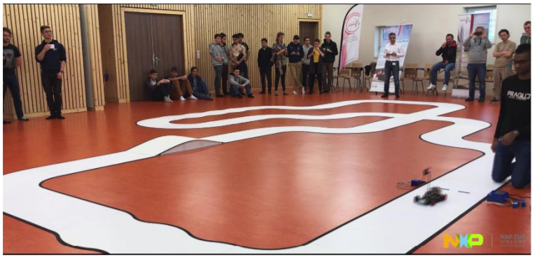
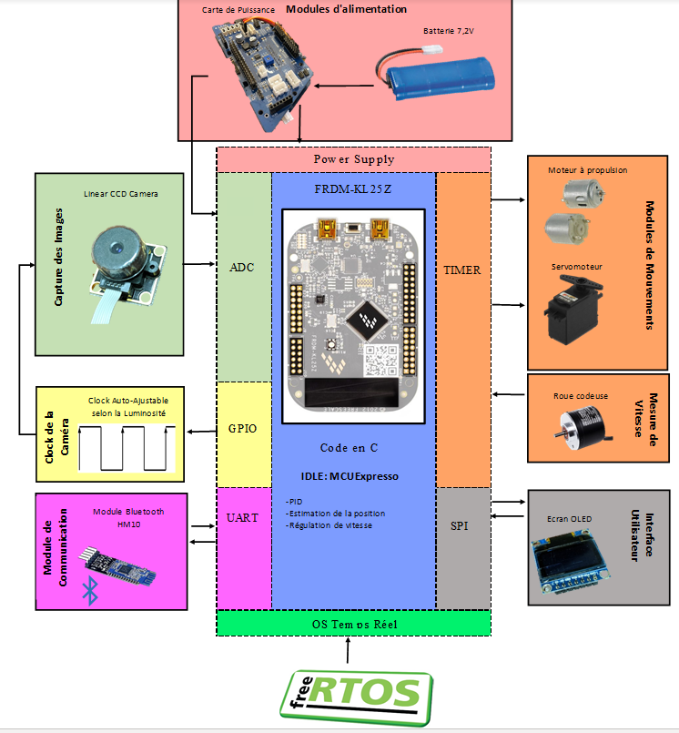

# NXPCUP
# Avertissment
Ce projet est difficilement reproductible (en raison d'une grosse partie hardware non expliquée ici), par conséquent, je n'utilise pas ce Git afin de vous expliquer comment faire votre propre véhicule autonome, mais plutôt pour recenser mes projets. Vous pouvez cependant vous en inspirer et utiliser toutes les ressource présent.

# Contexte
La NXP Cup est une compétition destinée aux étudiants en informatique embarquée.
Le but de cette compétition est de programmer un petit véhicule autonome, de telles sortes qu’il fasse le tour d’un circuit le plus vite possible. Ce circuit, dont le tracé n’est pas connu à l’avance, est composé de lignes droites, de courbes et de bosses. Ces éléments sont blancs et comportent des bandes noires sur les côtés, ce qui permet à la caméra embarquée de visualiser le parcours.

# Matériel nescessaire
- Kit Landzo Alamak : https://nxp.gitbook.io/nxp-cup/developer-guide/landzo-car-model/kit-contents/model-alamak
- Module BLE 
- Logiciel MCUXpresso

# Présentation des résultats
Le résultat de ce projet est un petit véhicule autonome capable de rester à l'intérieur du circuit tout en ajustant sa vitesse dans les virages:

L'utilisation du CPU est très faible grace à l'utilisation de FreeRTOS qui permet de n'utiliser le CPU que si une action est nécessaire.

# Liaison des composants avec la carte FRDM-KL25Z

Afin de faire avancer notre voiture, nous utilisons les moteurs à propulsion fournis dans le pack Alamak, ces derniers sont contrôlés par deux TIMERS en mode PWM. Pour faire de tourner notre voiture, nous utilisons un servomoteur afin de faire tourner les deux-roues avant du véhicule, ce dernier est aussi contrôlé par un TIMER en mode PWM. Nous avons aussi rajouté des roues codeuse non fournies dans le pack Alamak,  ces dernières sont nécessaire afin de pouvoir mesurer la différence entre la vitesse réelle et celle désirée.

Un écran OLED est disponible, nous avons décidé de l'utiliser afin de calibrer la sensibilité de la caméra afin d'avoir le meilleur contraste possible, ce dernier communique avec la carte grâce au protocole SPI.

Nous souhaitions pouvoir collecter des données afin de pouvoir augmenter les performances de notre voiture, pour ce faire, nous avons ajouté un module BLE afin que ce dernier communique avec un ordinateur distant qui utilise un code MATLAB afin de pouvoir tracer des graphiques et enregistrer les données au format Excel. Le module BLE communique avec notre carte grâce au protocole UART.

Concernant la caméra, c'est une caméra matricielle 1 x 128 qui permet de mesurer l'intensité lumineuse sur la piste, sachant que le blanc est plus lumineux que le noir nous pouvions déterminer les bandes limites du circuit, mais aussi la position de notre véhicule sur la piste. La sensibilité de la caméra dépendait de son temps d'exposition à la lumière, cette dernière était contrôlé par une clock créer à l'aide d'un GPIO et que l'on pouvais régler manuellement.

Ensuite, l'alimentation de notre voiture provenait d'une batterie 7.2 V et la puissance était répartie entre les différents composant grâce à une carte de puissance.

Enfin, le composant le plus important, le microcontrôleur FRDM-KL25Z permet de gérer tous nos composants, de plus l'utilisation de FreeRTOS nous pouvons réduire drastiquement la consommation de notre CPU et donc de notre batterie par la même occasion.

Le schéma ci-dessous résume mon explication :

